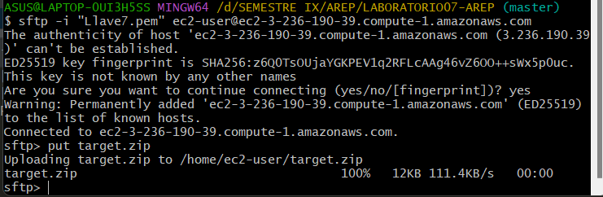

# LABORATORIO 7 AREP

En este laboratorio se desarrollara una aplicación web segura. 

### Autor: Daniela Garcia

### Prerequisitos
* Maven: Herramienta para la gestión y construcción de proyectos.
* Java: Lenguaje de programación.
* Git: Sistema de control de versiones distribuido.
* AWS: Servicio de nube.

## Solución

* Primero se crearon los certificados y sus llaves para poder probar los servidores de manera local.


* Para hacer la implementación en AWS se crearon dos instancias, una para cada servidor.


* En cada instancia se adicionaron dos reglas de entrada con los puertos que usa cada servidor.


*  En los metodos get se uso el DNS de cada instancia.


* Se crearon los certificados y las llaves


* En cada servidor se crearon los metodos que se encargaban de obtener el certificado y la llave del otro.


* Se ejecuto el siguiente comando para generar la carpeta target.

```

mvn clean install

```


* Se debe copiar la carpeta que contiene los certificados en la carpeta del target.


* Comprimimos la carpeta target en un archivo zip y con los siguientes comandos la pasamos a la instancia y la descomprimimos.

```

put target.zip

unzip target.zip

```





* Instalamos java en cada instancia con el siguiente comando: 

```
sudo yum install java-17-amazon-corretto-devel

```


* Para correr los servidores ejecutamos en cada maquina el siguiente comando:

```
java -cp "target/classes:target/dependency/*" org.example.ServerOne

java -cp "target/classes:target/dependency/*" org.example.ServerTwo


```


### Autor

* **Daniela García Romero**: [danielagar320](https://github.com/danielagar320)


